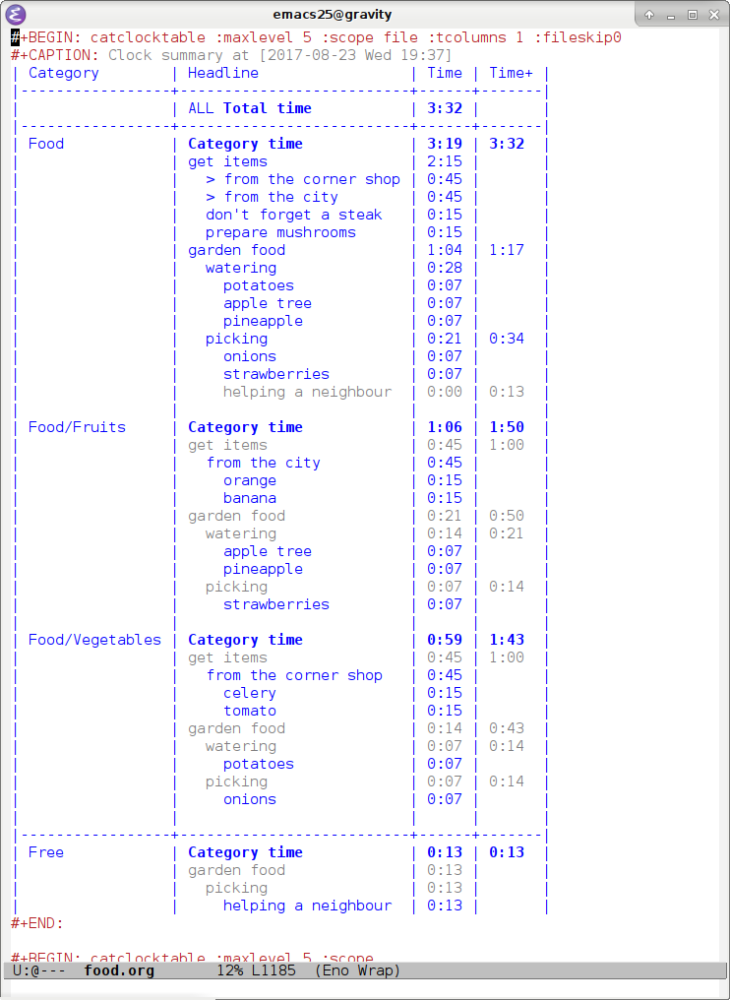

This is an official distribution of Eno, personal information
management program. Right now it is Emacs' mode derived from org-mode,
and providing additional functionality.

# Installation

To install Eno mode in your Emacs, compile it from source with `make
all`, and install it with `make install`. You might need root privileges
to perform installation. If you keep site-lisp packages in
non-standard location, create a `local.mk` file in the root directory of
source code, and modify one or more variables from `mk/defaults.mk` as
needed.

Eno mode requires `dash` library (available through melpa). To activate
Eno mode insert the following in your `.emacs` file:

    (autoload 'eno-mode "eno" "Eno." t)
    
    ;; Set Eno mode as default mode for .org files
    (add-to-list 'auto-mode-alist '("\\.org\\'" . eno-mode))

Most likely you will need to place it after `(package-initialize)`.

# What is Eno?

Eno is a free/libre personal information management system centered
around the idea of notes. It aims to help in getting the right
information at the right time, in the right place, in the right
form, and of sufficient completness and quality to perform the
current activity.

Eno mode is a crucial part of Eno system (so far the only part), and
is largely a derivative of Emacs' Org mode, which provides some
additional functionality. To learn more about Emacs and Org mode see
[here](https://www.gnu.org/software/emacs/) and [here](http://orgmode.org/).

Development of Eno is in early alpha stage, although some of its
functionalities are already working.

# Added functionality compared to Org mode

## Subcategories

In Org mode you can specify categories for all notes in a file with
`#+CATEGORY` keyword, or for a single note tree with `:CATEGORY:`
property. Eno introduces concept of subcategories. Each category can
have subcategories, and you specify them by providing their
paths. Category paths are similar to file paths in a file system: for
example a path `computing/web` defines a category `web`, which is a
subcategory of `computing`. If you defined a category elsewhere in the
note system (in a different note file), you don't have to provide its
full path – only its part that uniquely identifies it. In our example
we could create another notefile with category `web/development`. System
already knows that `web` is a subcategory of `computing`, and so we don't
need to include it in path.

There are situations where two or more categories share a name, but
have different paths. For example category `project` might useful as a
subcategory of `web`, but also as a subcategory of `computing`. Eno allows
it by requiring paths that uniquely identify such categories. And so a
project for a client of a website "comic-books.org" would have a note
file, with a path `web/project/comic-books.org`, and a personal project
of configuring new PC would have a note file with category path
`computing/project/build-pc`.

## Category Clock Tables

Eno makes use of nested categories when creating a category clock
table. In Org mode you can create [clock table](https://www.gnu.org/software/emacs/) for a given file, which
presents clocking information contained within the notes in a nice
form of a table, like so:

<code>
<table border="2" cellspacing="0" cellpadding="6" rules="groups" frame="none">

<colgroup>
<col  class="org-left" />

<col  class="org-left" />

<col  class="org-right" />
</colgroup>
<thead>
<tr>
<th scope="col" class="org-left">Headline</th>
<th scope="col" class="org-right">Time</th>
</tr>
</thead>

<tbody>
<tr>
<td class="org-left">ALL <b>Total time</b></td>
<td class="org-right"><b>3:32</b></td>
</tr>
</tbody>

<tbody>
<tr>
<td class="org-left"><b>File time</b></td>
<td class="org-right"><b>3:32</b></td>
</tr>

<tr>
<td class="org-left">get items</td>
<td class="org-right">2:15</td>
</tr>

<tr>
<td class="org-left">&ensp;&ensp;from the corner shop</td>
<td class="org-right">0:45</td>
</tr>

<tr>
<td class="org-left">&ensp;&ensp;&ensp;&ensp;celery</td>
<td class="org-right">0:15</td>
</tr>

<tr>
<td class="org-left">&ensp;&ensp;&ensp;&ensp;tomato</td>
<td class="org-right">0:15</td>
</tr>

<tr>
<td class="org-left">&ensp;&ensp;from the city</td>
<td class="org-right">0:45</td>
</tr>

<tr>
<td class="org-left">&ensp;&ensp;&ensp;&ensp;orange</td>
<td class="org-right">0:15</td>
</tr>

<tr>
<td class="org-left">&ensp;&ensp;&ensp;&ensp;banana</td>
<td class="org-right">0:15</td>
</tr>

<tr>
<td class="org-left">&ensp;&ensp;don't forget a steak</td>
<td class="org-right">0:15</td>
</tr>

<tr>
<td class="org-left">&ensp;&ensp;prepare mushrooms</td>
<td class="org-right">0:15</td>
</tr>

<tr>
<td class="org-left">garden food</td>
<td class="org-right">1:17</td>
</tr>

<tr>
<td class="org-left">&ensp;&ensp;watering</td>
<td class="org-right">0:28</td>
</tr>

<tr>
<td class="org-left">&ensp;&ensp;&ensp;&ensp;potatoes</td>
<td class="org-right">0:07</td>
</tr>

<tr>
<td class="org-left">&ensp;&ensp;&ensp;&ensp;apple tree</td>
<td class="org-right">0:07</td>
</tr>

<tr>
<td class="org-left">&ensp;&ensp;&ensp;&ensp;pineapple</td>
<td class="org-right">0:07</td>
</tr>

<tr>
<td class="org-left">&ensp;&ensp;picking</td>
<td class="org-right">0:34</td>
</tr>

<tr>
<td class="org-left">&ensp;&ensp;&ensp;&ensp;onions</td>
<td class="org-right">0:07</td>
</tr>

<tr>
<td class="org-left">&ensp;&ensp;&ensp;&ensp;strawberries</td>
<td class="org-right">0:07</td>
</tr>

<tr>
<td class="org-left">&ensp;&ensp;&ensp;&ensp;helping a neighbour</td>
<td class="org-right">0:13</td>
</tr>
</tbody>
</table>
</code>

However with Eno, you can group notes by their categories and
subcategories to learn more where your time went: how much was spent
on fruits, how much on vegetables, and how much on other things. To
create a category clock table, simply write `catclocktable` instead of
`clocktable`, and update the table.

<code>
<table border="2" cellspacing="0" cellpadding="6" rules="groups" frame="none">

<colgroup>
<col  class="org-left" />

<col  class="org-left" />

<col  class="org-right" />

<col  class="org-left" />
</colgroup>
<thead>
<tr>
<th scope="col" class="org-left">File</th>
<th scope="col" class="org-left">Headline</th>
<th scope="col" class="org-right">Time</th>
<th scope="col" class="org-left">Time+</th>
</tr>
</thead>

<tbody>
<tr>
<td class="org-left">&#xa0;</td>
<td class="org-left">ALL <b>Total time</b></td>
<td class="org-right"><b>3:32</b></td>
<td class="org-left">&#xa0;</td>
</tr>
</tbody>

<tbody>
<tr>
<td class="org-left">Food</td>
<td class="org-left"><b>Category time</b></td>
<td class="org-right"><b>3:19</b></td>
<td class="org-left"><b>3:32</b></td>
</tr>

<tr>
<td class="org-left">&#xa0;</td>
<td class="org-left">get items</td>
<td class="org-right">2:15</td>
<td class="org-left">&#xa0;</td>
</tr>

<tr>
<td class="org-left">&#xa0;</td>
<td class="org-left">  > from the corner shop</td>
<td class="org-right">0:45</td>
<td class="org-left">&#xa0;</td>
</tr>

<tr>
<td class="org-left">&#xa0;</td>
<td class="org-left">  > from the city</td>
<td class="org-right">0:45</td>
<td class="org-left">&#xa0;</td>
</tr>

<tr>
<td class="org-left">&#xa0;</td>
<td class="org-left">  don't forget a steak</td>
<td class="org-right">0:15</td>
<td class="org-left">&#xa0;</td>
</tr>

<tr>
<td class="org-left">&#xa0;</td>
<td class="org-left">  prepare mushrooms</td>
<td class="org-right">0:15</td>
<td class="org-left">&#xa0;</td>
</tr>

<tr>
<td class="org-left">&#xa0;</td>
<td class="org-left">garden food</td>
<td class="org-right">1:04</td>
<td class="org-left">1:17</td>
</tr>

<tr>
<td class="org-left">&#xa0;</td>
<td class="org-left">  watering</td>
<td class="org-right">0:28</td>
<td class="org-left">&#xa0;</td>
</tr>

<tr>
<td class="org-left">&#xa0;</td>
<td class="org-left">    potatoes</td>
<td class="org-right">0:07</td>
<td class="org-left">&#xa0;</td>
</tr>

<tr>
<td class="org-left">&#xa0;</td>
<td class="org-left">    apple tree</td>
<td class="org-right">0:07</td>
<td class="org-left">&#xa0;</td>
</tr>

<tr>
<td class="org-left">&#xa0;</td>
<td class="org-left">    pineapple</td>
<td class="org-right">0:07</td>
<td class="org-left">&#xa0;</td>
</tr>

<tr>
<td class="org-left">&#xa0;</td>
<td class="org-left">  picking</td>
<td class="org-right">0:21</td>
<td class="org-left">0:34</td>
</tr>

<tr>
<td class="org-left">&#xa0;</td>
<td class="org-left">    onions</td>
<td class="org-right">0:07</td>
<td class="org-left">&#xa0;</td>
</tr>

<tr>
<td class="org-left">&#xa0;</td>
<td class="org-left">    strawberries</td>
<td class="org-right">0:07</td>
<td class="org-left">&#xa0;</td>
</tr>

<tr>
<td class="org-left">&#xa0;</td>
<td class="org-left">    <em>helping a neighbour</em></td>
<td class="org-right"><em>0:00</em></td>
<td class="org-left"><em>0:13</em></td>
</tr>

<tr>
<td class="org-left">&#xa0;</td>
<td class="org-left">&#xa0;</td>
<td class="org-right">&#xa0;</td>
<td class="org-left">&#xa0;</td>
</tr>

<tr>
<td class="org-left">Food/Fruits</td>
<td class="org-left"><b>Category time</b></td>
<td class="org-right"><b>1:06</b></td>
<td class="org-left"><b>1:50</b></td>
</tr>

<tr>
<td class="org-left">&#xa0;</td>
<td class="org-left"><em>get items</em></td>
<td class="org-right"><em>0:45</em></td>
<td class="org-left"><em>1:00</em></td>
</tr>

<tr>
<td class="org-left">&#xa0;</td>
<td class="org-left">  from the city</td>
<td class="org-right">0:45</td>
<td class="org-left">&#xa0;</td>
</tr>

<tr>
<td class="org-left">&#xa0;</td>
<td class="org-left">    orange</td>
<td class="org-right">0:15</td>
<td class="org-left">&#xa0;</td>
</tr>

<tr>
<td class="org-left">&#xa0;</td>
<td class="org-left">    banana</td>
<td class="org-right">0:15</td>
<td class="org-left">&#xa0;</td>
</tr>

<tr>
<td class="org-left">&#xa0;</td>
<td class="org-left"><em>garden food</em></td>
<td class="org-right"><em>0:21</em></td>
<td class="org-left"><em>0:50</em></td>
</tr>

<tr>
<td class="org-left">&#xa0;</td>
<td class="org-left">  <em>watering</em></td>
<td class="org-right"><em>0:14</em></td>
<td class="org-left"><em>0:21</em></td>
</tr>

<tr>
<td class="org-left">&#xa0;</td>
<td class="org-left">    apple tree</td>
<td class="org-right">0:07</td>
<td class="org-left">&#xa0;</td>
</tr>

<tr>
<td class="org-left">&#xa0;</td>
<td class="org-left">    pineapple</td>
<td class="org-right">0:07</td>
<td class="org-left">&#xa0;</td>
</tr>

<tr>
<td class="org-left">&#xa0;</td>
<td class="org-left">  <em>picking</em></td>
<td class="org-right"><em>0:07</em></td>
<td class="org-left"><em>0:14</em></td>
</tr>

<tr>
<td class="org-left">&#xa0;</td>
<td class="org-left">    strawberries</td>
<td class="org-right">0:07</td>
<td class="org-left">&#xa0;</td>
</tr>

<tr>
<td class="org-left">&#xa0;</td>
<td class="org-left">&#xa0;</td>
<td class="org-right">&#xa0;</td>
<td class="org-left">&#xa0;</td>
</tr>

<tr>
<td class="org-left">Food/Vegetables</td>
<td class="org-left"><b>Category time</b></td>
<td class="org-right"><b>0:59</b></td>
<td class="org-left"><b>1:43</b></td>
</tr>

<tr>
<td class="org-left">&#xa0;</td>
<td class="org-left"><em>get items</em></td>
<td class="org-right"><em>0:45</em></td>
<td class="org-left"><em>1:00</em></td>
</tr>

<tr>
<td class="org-left">&#xa0;</td>
<td class="org-left">  from the corner shop</td>
<td class="org-right">0:45</td>
<td class="org-left">&#xa0;</td>
</tr>

<tr>
<td class="org-left">&#xa0;</td>
<td class="org-left">    celery</td>
<td class="org-right">0:15</td>
<td class="org-left">&#xa0;</td>
</tr>

<tr>
<td class="org-left">&#xa0;</td>
<td class="org-left">    tomato</td>
<td class="org-right">0:15</td>
<td class="org-left">&#xa0;</td>
</tr>

<tr>
<td class="org-left">&#xa0;</td>
<td class="org-left"><em>garden food</em></td>
<td class="org-right"><em>0:14</em></td>
<td class="org-left"><em>0:43</em></td>
</tr>

<tr>
<td class="org-left">&#xa0;</td>
<td class="org-left">  <em>watering</em></td>
<td class="org-right"><em>0:07</em></td>
<td class="org-left"><em>0:14</em></td>
</tr>

<tr>
<td class="org-left">&#xa0;</td>
<td class="org-left">    potatoes</td>
<td class="org-right">0:07</td>
<td class="org-left">&#xa0;</td>
</tr>

<tr>
<td class="org-left">&#xa0;</td>
<td class="org-left">  <em>picking</em></td>
<td class="org-right"><em>0:07</em></td>
<td class="org-left"><em>0:14</em></td>
</tr>

<tr>
<td class="org-left">&#xa0;</td>
<td class="org-left">    onions</td>
<td class="org-right">0:07</td>
<td class="org-left">&#xa0;</td>
</tr>

<tr>
<td class="org-left">&#xa0;</td>
<td class="org-left">&#xa0;</td>
<td class="org-right">&#xa0;</td>
<td class="org-left">&#xa0;</td>
</tr>
</tbody>

<tbody>
<tr>
<td class="org-left">Free</td>
<td class="org-left"><b>Category time</b></td>
<td class="org-right"><b>0:13</b></td>
<td class="org-left"><b>0:13</b></td>
</tr>

<tr>
<td class="org-left">&#xa0;</td>
<td class="org-left"><em>garden food</em></td>
<td class="org-right"><em>0:13</em></td>
<td class="org-left">&#xa0;</td>
</tr>

<tr>
<td class="org-left">&#xa0;</td>
<td class="org-left">  <em>picking</em></td>
<td class="org-right"><em>0:13</em></td>
<td class="org-left">&#xa0;</td>
</tr>

<tr>
<td class="org-left">&#xa0;</td>
<td class="org-left">    helping a neighbour</td>
<td class="org-right">0:13</td>
<td class="org-left">&#xa0;</td>
</tr>

<tr>
<td class="org-left">&#xa0;</td>
<td class="org-left">&#xa0;</td>
<td class="org-right">&#xa0;</td>
<td class="org-left">&#xa0;</td>
</tr>
</tbody>
</table>
</code>

Category clock table divides table into sections, one per category. It
also lists two time columns in place of one. Second column includes
times from headings of given section's parent category, and times of
notes that are of unrelated category.

Here is how it looks in Emacs:

